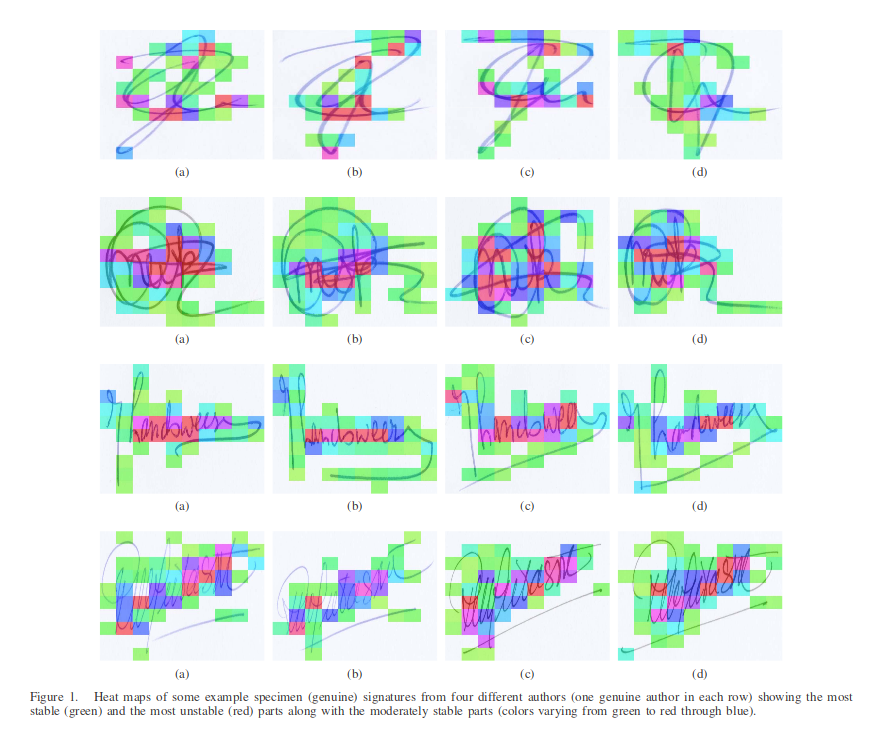
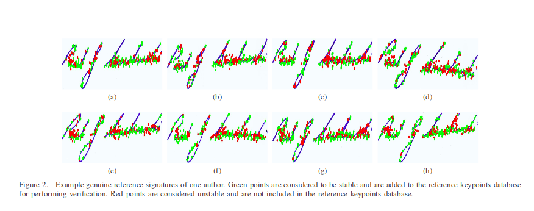

# Automatic Signature Stability Analysis And Verification Using Local Features

#### Project ID:- 6

####    Team :- 
    Mohit pavan kumar    				2018102016
    Tejaswini anuhya suma  		        	2018102018
    Raja Mavullu kumar			        2018102032
    Gongati Gowthami 				2018102048

##### Github Link :-

[git link - Morphers](https://github.com/Digital-Image-Processing-IIITH/project-morphers)

##### Paper Link :-

[paper link - Morphers](https://drive.google.com/file/d/1EohgZnBWzX9JZgEp0KLoT4iI_ZfVIGKi/view?usp=sharing)


#### Main Goals of the Project :-
1. To have a fully automatic system that can classify signatures as genuine, forged, disguised provided a few reference signatures are available in database based on the implementation of the given paper
2. Achieve an error rate of <= 15% on the 4NSigComp2010 dataset, the most well known publicly available dataset of forensic signature verification competition

#### Problem Definition :-
Present a novel signature stability analysis based on signature’s local / part-based features that can classify not only between genuine and forged signatures but also can recognise disguised signatures. The signatures being classified must have their ground truth signature(reference signature) in our database.
We say a signature is disguised if someone signs with the intention of hiding his/her identity later.
Our project will be tested on the famous 4NSigComp2010 dataset. This is the first ever publicly available dataset containing disguised signatures. 

#### Why is this project Important :-

1. Disguised signatures are usually difficult to identify as they are written by genuine/original authors but with intention to deny the authorship later.
2. Signature disguises are mainly performed for fraud e.g., a disguised signature on a bank check can be used to - withdraw cash and later on a claim can be made that the check did not contain the original signature. In such a case, it is very difficult for banks/financial institutions to distinguish between genuine and disguised signatures. 
3.  In addition, it is also not possible to have an expert forensic examiner available in all of the institutes.It is, therefore, required to enable automatic systems classify the three different genres of signatures, i.e., genuine, forged, and disguised, so that different types of such frauds can be prevented.

#### Algorithm :-
1. EXPLANATION OF ALGORITHM:-

   1. The first important decision about performing such an analysis is to whether perform it at global, or local, or both the levels simultaneously.
   2. The paper consists of local analysis because locals analysis helps focus on disguised signatures better as disguised signatures commonly involve in keeping the entire signature similar to their original signatures except adding or removing a tiny portion or certain strokes.
   3. The paper analyzed the local stability of signatures via Speeded Up Robust Features (SURF). 
   4. SURF represents an image/signature as a set of keypoints. It detects blob like structures from images and computes hessian matrix using integral images
   5. It is  inspired by Scale Invariant Feature Transform (SIFT)
2. ALGORITHM HYPOTHESIS AND LABELS:-

   1.  Hypothesis(which are partially proven):-
        1. SURF Key points from some areas in the image give better results than from other areas
        2. This stability analysis is applicable to all other authors
   4. The white colored bins show the absence of any key points in that particular bin while the colors varying from green through blue to red indicate the bins having keypoints. 
   5. The green color shows the stable regions, i.e., the regions having the key points which are at a minimum distance from the reference key points dataset.
   6. The red color shows the portions of the examined signature which are at the maximum distance from the reference
   7. Main agenda of assigning these colors is if a part of the query has more similarities to original signature then heat value of the map at that part becomes green.





3. ALGORITHM:
   1. Compute the key points  from all the genuine signatures of an author in the database except only one genuine reference signature and make a key points database temporarily. Let this database be named temp.
   2. Compute the key points from the remaining genuine reference signature from the database and compare the distances of all of its  key points from the  temp database which was calculated earlier.
   3. Find the average distance(distance type-euclidean)and then mark all keypoints having distance less than or equal to the average distance as green and all other key points red.
   4. It is Important to notice that the final database will contain only green/stable Key Points.
   5. Repeat this process for every genuine specimen signature in an ’n-1 cross validation manner’ and populate a final reference key points database using only the stable key points or parts which are green colored from different reference/specimen signatures
   6. Now after getting this final database, we extract key points and 128 bit descriptors for the query signature.We compare  between the query signature key points and the key points present in our final reference key points database for the author of query signature
   7. Find the local key points from the query signature by using SURF method. Then take the first keypoint of the query Image and compare it with all the features present in the final reference key points database, one by one.
   8. If a query signature keypoint is at a distance less than an empirically found threshold θ(which here is taken 1000), note the keypoint.
   9. Keep this process going until all the query signature’s keypoints are traversed.
   10. Calculated the probability using the key points which actually matched with the key points in final reference database which gives average local features of the query signature that are in final reference database 


#### Results of the Project :-
1. Have a full fledged automatic system classifying between genuine, forged, disguised signatures which can be used for fraud detection in various areas. 
2. Reference signatures can be added to the database with ease enabling use of our system in industry.
3. Achieve an error rate of <= 15% on the 4NSigComp2010 competition dataset.

#### Timeline:-

|UPDATE                   |      TIMELINE EXPECTED|
|--------------------------|--------------------|
Learn about SURF        |      23th October 2020
Rough Implementation | 30th October 2020 
Testing Phase I (Mid Evaluation) | 31st October 2020
Final Implementation | 12th November 2020
Testing Phase II | 14th November 2020
Fix bugs found in previous testing phases| 15th November 2020
Final Testing |16th November 2020
Documentation| 18th November 2020
Final commit |Project Submission deadline

#### Dataset Required :- 
   [dataset](http://www.iapr-tc11.org/dataset/4NSigComp2010/Dataset_4NSigComp2010.zip)
   
   for now we have downloaded the dataset but we are facing some difficulty in the extraction and we will try to figure this out , so we may ask for the help regarding this.


```python

```
